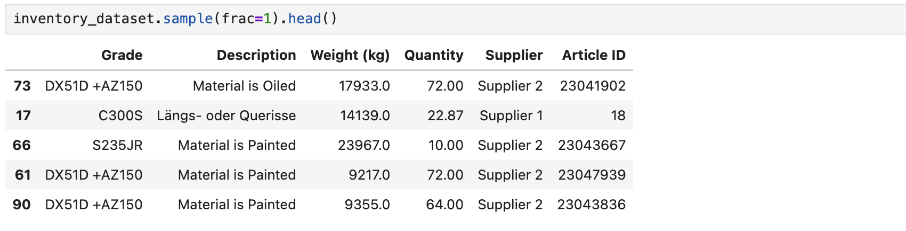
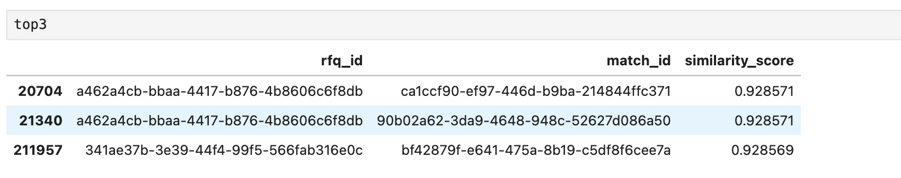
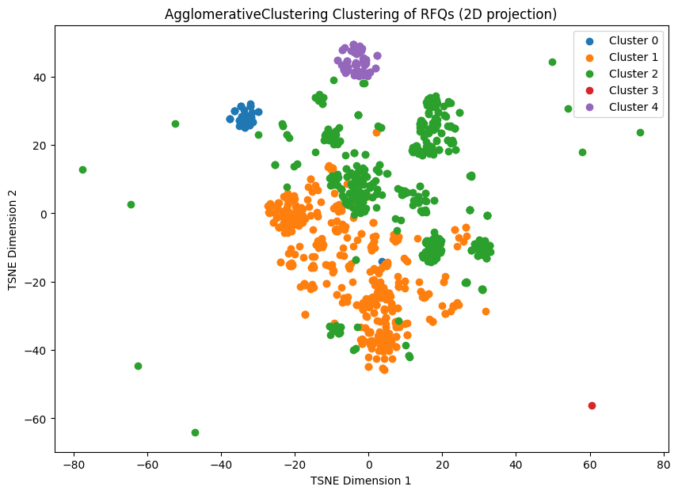

# **Vanilla Steel Case Assessment**

[](https://www.python.org/downloads/release/python-396/)
[](https://pypi.org/project/pandas/2.3.2/)
[](https://pypi.org/project/scikit-learn/1.6.1/)

## About Project

This project is related to the solution of case assessment for <b>Vanilla Steel</b> company. 
In this project, we used `Jupyter Notebook` to develop all the codes belongs Task-1 and Task-2.
The repository structure is as follows:

```bash
vanilla-steel-assessment
├── output
│   ├── inventory_dataset.csv
│   └── top3.csv
├── assets
├── run.ipynb
├── report.html
├── README.md
└── .gitignore
```
All the code has been written in `run.ipynb` with related explanation of each part of the code, which makes this notebook easy to follow, 
Also in case of any errors, the html output of the notebook can be found in `report.html` file with all the corresponding output of cells.
The deliverable of this assessment file can be found under `output` folder. 

## How To Run

In order to run and reproduce the results, first the jupyter notebook package must install.

` pip install notebook`

Then with following command you can start jupyter server and select the `run.ipynb` file:

`jupyter notebook`

Do not forget to place all the task-1 and task-2 files under `resources` folder or you can change the path of files in the earliest cell within jupyter notebook.

## Result

For a quick look from this file, I also put the image of result for each task within this file.

### Task-1
In the below image, we can see the shuffled head of `inventory_dataset.csv` file.



### Task-2
We can see the top3 RFQs that has the most similarity to each other in the below image.


Also after applying clustering and TSNE for visualization, we can demonstrate RFQs within different clusters like image below.




